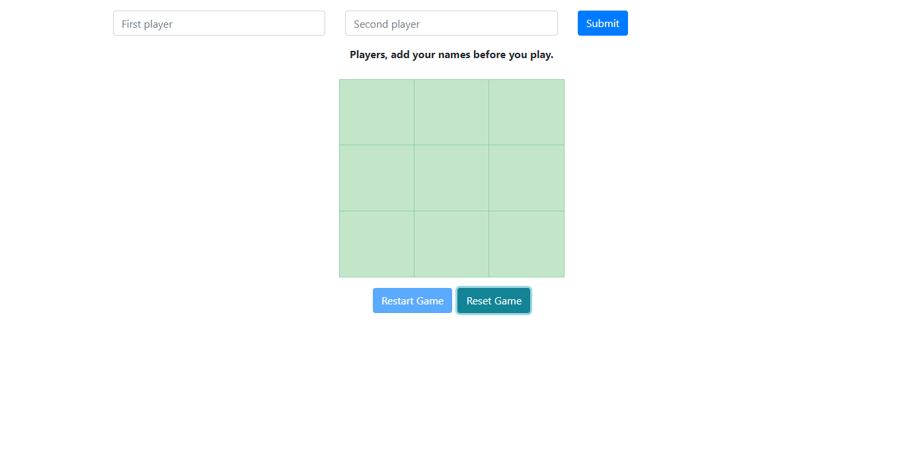

### Tic Tac Toe Game

## Description

The project builds a tic tac toe game that you can play on the browser. The game data is stored in the local storage.




## Built with

- Javascript
- HTML & CSS

## Live Demo 

[Website link](https://raw.githack.com/blackpintz/tic-tac-game-js/test-game-using-jest/dist/index.html)

## Getting Started

To get a local copy up and running follow these simple example steps.

## Prerequisites

- Install node.

## Set up

- Clone the project.
- Cd into the project directory.
- Run ```npm install``` to install linter packages.
- Run ```npm run build```
- Run ```npm test``` to see the tests for all files.
- Open ```index.html``` file on your localhost and play the game.


## Author

- Github: [@blackpintz](https://github.com/blackpintz)
- Twitter: [@blackpintz](https://twitter.com/blackpintz)


## 🤝 Contributing

Contributions, issues and feature requests are welcome!

Feel free to check the [issues page](https://github.com/blackpintz/tic-tac-game-js/issues).

## Show your support

Give a ⭐️ if you like this project!

## Acknowledgments

- [Microverse](https://www.microverse.org/)


